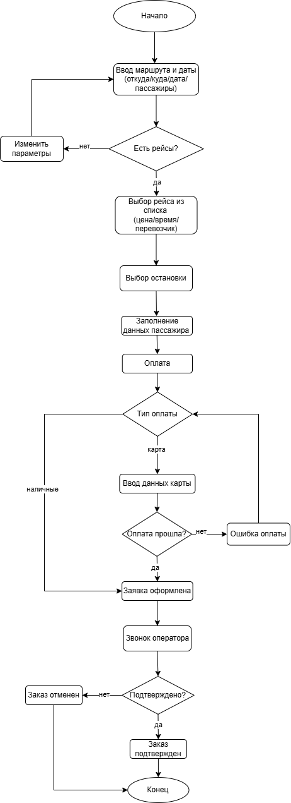

# Анализ сервиса бронирования междугородних поездок Atlasbus.by

**Выполнила:** Сидорук Оксана
**Продукт для анализа:** [Atlasbus.by](https://atlasbus.by/)

---

## Содержание

1. [Часть 1. Анализ текущего состояния](#часть-1-анализ-текущего-состояния)
   - [1.1. Основные функции и пользователи](#11-основные-функции-и-пользователи)
   - [1.2. Схема ключевого процесса](#12-схема-ключевого-процесса)
   - [1.3. Пользовательские боли и проблемы](#13-пользовательские-боли-и-проблемы)
2. [Часть 2. Стратегия и AI-идеи](#часть-2-стратегия-и-ai-идеи)
   - [2.1. Product Vision](#21-product-vision)
   - [2.2. Стратегическая цель на год](#22-стратегическая-цель-на-год)
   - [2.3. Генерация AI-идей](#23-генерация-ai-идей)
   - [2.4. Выбор лучшей идеи](#24-выбор-лучшей-идеи)
3. [Часть 3. Рефлексия использования AI](#часть-3-рефлексия-использования-ai)
   - [3.1. Промпты и анализ](#31-промпты-и-анализ)

---

## Часть 1. Анализ текущего состояния

### 1.1. Основные функции и пользователи

**Основные функции сервиса:**
- **Поиск рейсов** — пользователь вводит маршрут, дату, количество пассажиров, система показывает доступные рейсы от всех перевозчиков-партнёров
- **Сравнение вариантов** — возможность сравнить рейсы по цене, времени отправления и перевозчику
- **Запись на рейс** — бесплатная онлайн-запись с оплатой наличными водителю при посадке (на части маршрутов)
- **Покупка билета онлайн** — оплата картой (Visa, Mastercard, Belcard), билет приходит на email или в приложение
- **Управление поездками** — история покупок, возврат билетов, просмотр маршрутов

**Основные пользователи:**
- **Студенты и молодёжь (18–25 лет)** — наиболее активный сегмент, ездят регулярно, ценят скорость и низкую цену
- **Работающие взрослые (25–45 лет)** — деловые поездки и визиты к родственникам, важны надёжность и удобная оплата картой
- **Жители малых городов** — используют сервис для поиска рейсов там, где нет кассы или расписание неочевидно
- **Туристы и иностранцы** — межгород, трансферы, используют мультиязычный интерфейс

**Основные потребности, которые закрывает сайт:**
- Быстро найти рейс
- Сравнить цену и время
- Гарантированно купить билет
- Не ошибиться с датой и направлением

---

### 1.2. Схема ключевого процесса

**Процесс:** Бронирование поездки

*Полное описание шагов и альтернативных путей см. в файле [`/ba/analysis.md`](ba/analysis.md)*

---

### 1.3. Пользовательские боли и проблемы

#### Проблема 1: Ненадёжность поездки (самая критичная)

**Описание:** Пользователь не уверен, что уедет, даже если забронировал, оплатил и пришёл вовремя. Маршрутка может не приехать, рейс отменяют в последний момент, водитель уезжает раньше.

**Последствия:** пропущенные самолёты, стресс, потеря денег

**Влияние на метрики:** Retention ↓↓↓, NPS ↓↓↓, Conversion ↓

---

#### Проблема 2: Недостоверная и несогласованная информация

**Описание:** Данные в приложении не совпадают с реальностью: разное время отправления, разные номера машин, изменения не обновляются. Приложение перестаёт быть «источником правды».

**Влияние на метрики:** Trust ↓↓↓, Conversion ↓, Support load ↑

---

#### Проблема 3: Баги и рассинхронизация данных

**Описание:** Система не сохраняет корректно изменения. В приложении данные изменены, но у водителя остаётся старая информация. Нет единого источника данных между системой и водителем.

**Влияние на метрики:** UX ↓, Trust ↓, ошибки при поездке ↑

---

## Часть 2. Стратегия и AI-идеи

### 2.1. Product Vision

> Через 2 года продукт станет надёжной интеллектуальной платформой для междугородних перевозок, которая обеспечивает пользователю предсказуемый и безопасный опыт поездки.

Пользователь сможет:
- быстро решать любые проблемы через AI-ассистента
- быть уверенным в выполнении поездки и сохранности своих средств

Платформа будет предоставлять гарантии качества сервиса, включая безопасную оплату с временной блокировкой средств до подтверждения выполнения поездки и автоматическим возвратом в случае сбоев.

---

### 2.2. Стратегическая цель на год

**Цель:** Повысить надёжность и предсказуемость сервиса, обеспечив максимальную долю успешно выполненных поездок и быстрых решений пользовательских проблем.

**Обоснование:** Основная проблема — отсутствие гарантии выполнения поездки и слабая поддержка в случае сбоев. Фокус на повышении надёжности позволит снизить количество срывов поездок, повысить доверие пользователей и улучшить пользовательский опыт даже в случае возникновения проблем.

---

### 2.3. Генерация AI-идей

| № | Идея | Краткое описание |
| :--- | :--- | :--- |
| 1 | **AI-ассистент сопровождения и решения проблем** | Интеллектуальный ассистент, сопровождающий пользователя от бронирования до завершения поездки. Отвечает на вопросы, помогает с возвратом, предлагает альтернативные рейсы, автоматизирует обработку запросов |
| 2 | **AI-оптимизация маршрутов** | Помогает находить оптимальные варианты поездок даже при отсутствии прямых рейсов. Предлагает маршруты с пересадками, альтернативные точки отправления и прибытия |
| 3 | **AI-прогноз спроса и загрузки** | Анализирует данные о поездках и поведении пользователей для прогнозирования спроса. Помогает перевозчикам оптимизировать количество транспорта и расписание, снижая количество отмен |

---

### 2.4. Выбор лучшей идеи

**Выбранная идея:** AI-ассистент сопровождения и решения проблем

**Почему она полезна:**
- Решает ключевую проблему — отсутствие поддержки в критических ситуациях
- В случае сбоев пользователь получает мгновенную помощь и конкретные варианты решения
- Снижает стресс и повышает удовлетворённость сервисом

**Почему она реалистична:**
- Можно внедрять поэтапно, начиная с автоматизации типовых сценариев
- Безопасная модель оплаты с автоматическим возвратом средств повышает доверие

---

## Часть 3. Рефлексия использования AI

### 3.1. Промпты и анализ

**Использованные промпты:**

1. *«Проанализируй сервис бронирования междугородних поездок и опиши его основные функции. Выдели ключевые группы пользователей и опиши их основные потребности и цели при использовании сервиса»*

2. *«Проанализируй предоставленные отзывы пользователей и выдели основные проблемы и повторяющиеся негативные сценарии. Обрати внимание на факторы, которые могут влиять на пользовательский опыт и ключевые метрики продукта»*

3. *«На основе отзывов сформулируй 2–4 ключевые пользовательские боли. Для каждой боли опиши, в чём она заключается и как влияет на поведение пользователей и метрики продукта»*

4. *«Предложи идеи использования AI для улучшения. Идеи должны быть связаны с выявленными пользовательскими проблемами и направлены на улучшение пользовательского опыта или эффективности сервиса»*

5. *«Сформулируй краткое Product Vision для сервиса бронирования поездок на 2 года вперёд. Учитывай выявленные проблемы пользователей и предложенные решения, сделай акцент на ценности для пользователя»*

**На каких этапах AI помог:**

| Этап | Как AI помог |
| :--- | :--- |
| **Анализ отзывов** | Структурировал отзывы, выделил основные проблемы и негативные сценарии |
| **Генерация идей** | Предложил и расширил возможные AI-решения |
| **Уточнение формулировок** | Сделал текст более логичным, структурированным и понятным |
| **Формирование стратегии** | Помог связать пользовательские боли, цели продукта и предложенные решения |

**Где использовался собственный опыт:**

| Этап | Почему |
| :--- | :--- |
| **Построение схемы процесса** | AI предлагает обобщённые или неточные варианты, схема разработана самостоятельно |
| **Редактирование описания схемы** | Текст, предложенный AI, был скорректирован, так как не полностью соответствовал логике процесса |
| **Поиск отзывов пользователей** | Отзывы найдены вручную, чтобы использовать реальные данные, а не сгенерированную информацию |
| **Принятие продуктовых решений** | Выбор ключевых проблем и приоритетной AI-идеи сделан самостоятельно |

**Что нового узнала в процессе:**

- Использование AI помогло ускорить анализ информации, структурировать идеи и улучшить формулировки
- Основные продуктовые решения принимались на основе собственного анализа
- AI является хорошим инструментом для поддержки анализа и генерации идей, но требует доработки, так как иногда даёт неточные ответы

---

## Ссылки на файлы

| Файл | Описание |
| :--- | :--- |
| [`/ai/prompts.md`](ai/prompts.md) | Промпты и рефлексия использования AI |
| [`/ba/analysis.md`](ba/analysis.md) | Полный анализ текущего состояния (часть 1) |
| [`/pm/strategy.md`](pm/strategy.md) | Стратегия и AI-идеи (часть 2) |
